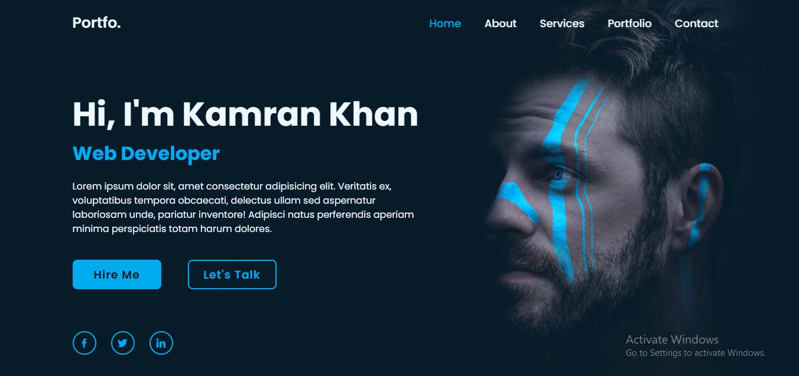

# Portfolio Website

This repository contains the code for a **responsive portfolio website** designed to showcase personal information, skills, services, and projects in an elegant and modern layout.

## 📑 Features
- **Responsive Design**: Adapts seamlessly to various screen sizes.
- **Interactive Navigation Bar**: Smooth and intuitive navigation experience.
- **Dynamic Buttons and Animations**: Engaging call-to-action buttons and hover effects.
- **Social Media Integration**: Quick links to social profiles.
- **Modern Aesthetics**: Clean design with professional color schemes.

## 🛠️ Technologies Used
- **HTML5**: Semantic and accessible structure.
- **CSS3**: Advanced styling with animations and hover effects.
- **Boxicons**: For attractive and modern icons.
- **Google Fonts**: Enhanced typography using the "Poppins" font.

## 🎨 Design Highlights
- **Fixed Header**: Always-visible navigation bar for easy access.
- **Background Animation**: Subtle animation effects for an engaging user experience.
- **Call-to-Action Buttons**: Highlighted links for user engagement.
- **Social Media Links**: Stylish circular icons linking to social profiles.

## 📸 Preview
### **Home Page**


---

## 🚀 Getting Started
Follow these instructions to set up and view the project locally.

### Prerequisites
Ensure you have the following:
- A modern web browser (e.g., Chrome, Firefox, Edge).
- A code editor like **Visual Studio Code** (optional for customization).

### Installation
1. Clone this repository:
   ```bash
   git clone https://github.com/Muhammad-Kamran-Khan/portfolio-website
2. Navigate to the project directory:
   ```bash
    cd portfolio-website
3. Open the `index.html` file in your browser to view the website.

## 📂 Project Structure

    ```bash
     portfolio-website/
     │
     ├── index.html       # Main HTML file
     ├── styles.css       # Styling file with animations and layout
     ├── home.jpg         # Background image

## 🎯 Customization

- **Edit Content**: Update `index.html` to personalize the text, links, and headings.
- **Change Styles**: Modify `styles.css` for custom colors, fonts, and animations.
- **Background Image**: Replace `home.jpg` with your desired background image.

## 🤝 Contributing

Contributions are welcome! Here's how:

1. Fork this repository.
2. Create a new branch:
   ```bash
   git checkout -b feature-name
3. Commit your changes:
    ```bash
    git commit -m "Add your feature"
4. Push to the branch:
    ```bash
    git push origin feature-name
5. Open a pull request.

## 📧 Contact

Feel free to reach out for feedback, suggestions, or collaborations:

- **Email**: [kamranmuhammad12k@example.com](mailto:kamranmuhammad12k@example.com)
- **GitHub**: [Muhammad-Kamran-Khan](https://github.com/Muhammad-Kamran-Khan)

